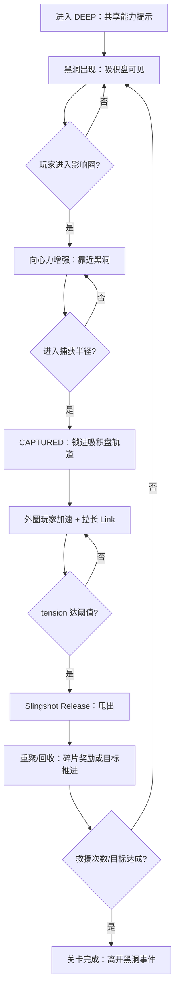

# Delta GDD — DEEP 黑洞关（Accretion Disk Slingshot）

> 本文档是 **差异化说明书（Delta GDD）**：只描述“相对当前 demo（游乐场 + 章节脚本体系）新增了什么”。  
> 目标：在不推翻现有核心循环（碎片：激活→收集；Tier：SEVERED→ASCENSION）的前提下，新增一个 **只在 DEEP 出现的黑洞关卡**，用“深渊—连接—救援”的隐喻强化主题。

---

## 0. 变更摘要（What’s New）

### 0.1 新增内容
- **新增关卡**：`Level 4B —「深度：黑洞助推救援」`（仅在 `DEEP (7–9)` 解锁/出现）
- **新增关卡对象**：黑洞（Black Hole）+ 吸积盘（Accretion Disk）轨道锁定行为
- **新增核心玩法题**：一人被吸入“更深处”进入锁轨；另一人在外圈加速，通过 **Link 拉力**触发一次“重力助推（Slingshot）”把同伴甩出

### 0.2 不做的事（Non-goals）
- 不引入复杂天体 N 体模拟 / 广义相对论 / 真实椭圆轨道参数
- 不在 DEEP 之外引入黑洞（避免破坏“关系阶段主线”）
- 不把黑洞做成硬失败点（不会吞噬消失；失败仅保留 SEVERED 的崩解口径，见 `docs/systems/level_scripting.md`）

---

## 0.3 口径确认（Implementation Decisions / MVP Freeze）

> 这些口径会直接进入实现与验收，避免返工。

- **出现方式**：进入 `DEEP` 后黑洞事件 **必出一次**（非随机）。
- **出现时机**：进入 `DEEP` 后 **延迟 10s** 生成黑洞（给玩家时间适应“共享能力”与当前局面）。
- **生成位置**：黑洞生成在**当前质心附近**（围绕 `centerOfMass` 小范围随机偏移），保证可见与可预期。
- **完成条件**：黑洞事件以 **救援次数 `rescues >= 2`** 作为完成条件（不绑定碎片奖励）。
- **Link 可见性覆盖（关键）**：黑洞事件窗口内强制 `linkBreakDistance = Infinity`，保证救援过程“线=工具”始终可读。  
  - **覆盖范围**：从 `BlackHoleSpawned`（事件开始）到 `BlackHoleDespawned`（事件完成/黑洞消失），结束后恢复原 Tier 配置。
- **拉回（Link Constraint Pull）覆盖**：黑洞事件窗口内将“超距拉回”视为干扰项，建议 **禁用或极弱化**（优先可控与可读）。  
  - 推荐：`maxDistancePullScale = 0`（仅在事件窗口；保留 `minDistance` 推开防抖）。
- **捕获规则**：任意一人可被捕获；**禁止“双人同时被捕获”**（若第二人进入捕获圈，则推离/弹出到外圈）。
- **锁轨可控性**：CAPTURED 状态允许 **轻微径向挣扎** + 切向微调（不完全剥夺控制）。
- **体验目标**：玩家在 **30–60 秒内能完成一次救援**（治愈优先、低挫败）。
- **资源范围（v1）**：先不做救援奖励、先不新增音效（贴图使用 `src/assets/black_hole.png`）。

---

## 1. 与现有机制的对齐（Mechanics Handshake）

### 1.1 前提：黑洞只在 DEEP 出现
依据 `docs/systems/link_tiers.md` 的口径：  
- **DEEP**：能力共享（双方都可探测 + 收集），连接线可断开但 **不造成能力损失**。  

黑洞关将利用这一点：
- 玩家在深渊中不会“失能/失败”，能专注在 **救援协作动作**本身。

### 1.2 轴分层保持一致（沿用 `level_scripting` 的三轴）
参照 `docs/systems/level_scripting.md` 的三条轴：
- **物理约束（手感）**：`minDistance / maxDistance` 仍负责推开/拉回（基础张力）
- **连接可见性（沟通）**：`linkBreakDistance` 决定引力线何时消失（LINKED/BROKEN）
- **主体性/能力（叙事）**：DEEP 阶段能力共享，不受距离影响

> 黑洞关的核心增量不是“让你更容易断线”，而是：  
> **把 Link 从“提示关系状态的线”升级为“救援工具（可操作的拉力）”。**

### 1.3 关卡覆盖（Overrides）
为保证玩法可读、治愈、以及“线=救援”成立，本关建议覆盖：
- `linkBreakDistance`：在黑洞事件期间 **提高或禁用**（保持 Link 可见），避免玩家在关键救援时“线消失导致读不懂发生了什么”
  - 推荐：`linkBreakDistance = Infinity`（仅在本关或黑洞事件窗口内）
- 保留 `minDistance` 推开（避免重叠抖动），`maxDistance` 拉回可保留但建议减弱（避免和黑洞向心力打架）

---

## 2. 新增关卡玩法说明（How It Plays）

### 2.1 现象（玩家看到什么）
- 当 Celu / Ak 靠近黑洞时，会受到强大的向心力（被“吸向中心”）。
- 如果玩家不反抗，他们不会消失，而是被锁死在黑洞的 **吸积盘轨道**上做极速圆周运动（可控、可预期）。

### 2.2 非失败设定（Design Safety）
- **CAPTURED（锁轨）不是死亡**：它是关卡进入“救援题”的状态切换。
- 玩家仍能输入（只是主要表现为沿轨道加减速/轻微改轨），避免“我按了没反应”的挫败。

### 2.3 逃逸解法（Slingshot Rescue）
两名玩家必须利用 Link 产生的拉力：
- 一方（例如 Celu）被吸入更深处进入吸积盘锁轨（CAPTURED）
- 另一方（Ak）留在外圈加速（OUTER）
- 当外圈玩家达到足够速度并拉长 Link，系统累积 **张力/蓄能（tension）**
- 达到阈值后触发 **Slingshot Release**：通过 Link 的反作用把 CAPTURED 的玩家“甩”出吸积盘，回到外圈安全半径

### 2.4 叙事隐喻（保持极简）
**在深渊中，唯一能把你拉住的是你与外界的连结。**

---

## 3. 关卡心流图（Flow / State Diagram）

> 说明：这是“玩家心流 + 系统状态”的合成图，便于策划/程序/美术对齐。

---

## 4. 玩家体验流程（Player Experience Walkthrough）

### 4.1 第一次接触（10–20s）
- 进入 DEEP：弹一次性提示 **“现在你们都可以探测和收集了。”**
- 黑洞出现：玩家看到吸积盘与影响圈边界（视觉上像“可进入的风暴”）

### 4.2 进入深渊（10–30s）
- 一人被吸入并锁轨（CAPTURED），短提示：  
  - **“别怕，你不会消失。让同伴在外圈加速，用引力线把你甩出去。”**
- 玩家体感：在轨道上“被带着跑”，但还能微调，理解这是一个状态而不是失败

### 4.3 协作救援（20–60s）
- 外圈玩家开始加速，Link 逐渐拉直、发光、出现张力 UI（建议：线条变亮/变粗 + 简单进度条）
- 达阈值触发释放：短慢动作 + 和声上行（治愈爽点）
- 被救玩家被甩出吸积盘，回到外圈可控区

### 4.4 收束（15–30s）
两种收束方式二选一（推荐 A）：
- A) 要求完成 **2 次救援**（保证学会）
- B) 完成 **1 次救援 + 收集若干黑洞边缘碎片**（连接主循环）

---

## 5. 触发条件与逻辑（Triggers & Logic）

### 5.1 关卡触发（宏观）
- **出现条件**：`OnTierEntered(DEEP)` 后，本关卡可被脚本选中（替代或追加现有 Level 4）
- **不出现条件**：任何非 DEEP Tier（避免破坏阶段语义）

### 5.2 黑洞对象触发（微观）
新增黑洞对象的推荐状态：
- `INACTIVE`：未生成/不在场
- `ACTIVE`：在场，影响圈生效
- `CAPTURED(p)`：某玩家被锁轨（p ∈ {Celu, Ak}）
- `EJECTED(p)`：完成一次甩出（短暂状态，用于提示/计数）

### 5.3 关键判定（建议口径）
- **Influence**：`distToBH < influenceRadius` → 施加向心力
- **Capture**：`distToBH < captureRadius` 且玩家未 CAPTURED → 进入锁轨
- **Tension Accumulate**：
  - 条件：存在 CAPTURED 玩家 + 外圈玩家速度 `> speedThreshold` + Link 距离 `> distanceThreshold`
  - 结果：`tension += rate * dt`（并做上限 clamp）
- **Release**：
  - 条件：`tension >= 1.0`（满）或满足“角度窗口”条件（可选）
  - 结果：对 CAPTURED 玩家施加一次 `ejectImpulse`（指向盘外），并清空/衰减 tension

> 治愈优先建议：先做 **“tension 满即释放”**，不要求精确角度窗口（降低挫败）。

### 5.4 新增关卡输入/输出映射表（I/O Mapping）

> 目的：把“这个关卡新增了哪些输入信号、会产出哪些输出效果/事件”写成表，便于实现对齐与验收。  
> 说明：下表把 I/O 分为三层：**玩家输入**、**系统/状态输入**、**关卡脚本输入**；输出分为 **物理输出**、**状态输出**、**事件输出**、**UI/音频输出**。

#### 5.4.1 输入（Inputs）

| 输入类别 | 输入项 | 来源 | 用途（在本关如何被消费） |
|---|---|---|---|
| 玩家输入 | Celu 移动（W/A/S/D） | 现有 demo | 影响 Celu 速度/轨迹；当 Celu 是 OUTER 时可用于“外圈加速”；当 Celu 被 CAPTURED 时用于沿切向加减速（弱控制）。 |
| 玩家输入 | Ak 移动（↑/←/↓/→） | 现有 demo | 同上。 |
| 系统/状态 | `linkTier` | 现有 demo | **黑洞只在 `DEEP` 生效**；非 DEEP 直接不生成/不启用黑洞对象。 |
| 系统/状态 | `celu.position / ak.position` | 现有 demo | 计算 `distToBH`、计算 Link 距离、判断 Influence/Capture/Release。 |
| 系统/状态 | `celu.velocity / ak.velocity` | 现有 demo | 判定外圈玩家是否达到 `speedThreshold`；用于锁轨时的“切向速度设定”；用于释放时叠加 `ejectImpulse`。 |
| 系统/状态 | `distance = getDistance(celu, ak)` | 现有 demo | 用于 `distanceThreshold`（拉长 Link）与 tension 累积条件。 |
| 系统/状态 | `dt / now` | 现有 demo | tension 积累、提示冷却、锁轨插值（平滑）。 |
| 关卡参数 | `BlackHole` 参数（`influenceRadius/captureRadius/diskInner/diskOuter/pullStrength/GM`） | 新增 | 黑洞力场与吸积盘锁轨行为的核心配置；可由关卡覆盖。 |
| 关卡参数 | `speedThreshold / distanceThreshold / tensionRate / ejectImpulse` | 新增 | Slingshot 的门槛与强度配置（治愈优先：门槛低、强度可控）。 |
| 关卡脚本 | `ApplyOverrides(linkBreakDistance=Infinity)` | `level_scripting` | 在救援体验期间保持 Link 可见，确保“线=救援工具”可读。 |
| 关卡脚本 | 目标/计数规则（如 `rescues >= 2`） | `level_scripting` | 驱动关卡完成（不新增失败）。 |

#### 5.4.2 输出（Outputs）

| 输出类别 | 输出项 | 目标对象 | 触发时机/条件 | 玩家可感知反馈 |
|---|---|---|---|---|
| 物理输出 | 向心力加速度 `aToBH` | Celu/Ak | `distToBH < influenceRadius` | 靠近黑洞会“被吸”，但强度渐进、可预期。 |
| 状态输出 | `blackHoleState = ACTIVE/INACTIVE` | 黑洞对象 | 关卡开始/结束或事件窗口 | 黑洞是否在场（盘/影响圈显示与否）。 |
| 状态输出 | `playerCaptureState = FREE/CAPTURED` | 被吸入玩家 | `distToBH < captureRadius` | 角色进入吸积盘后“被锁在轨道上”。 |
| 物理输出 | 锁轨速度投影/插值（切向速度） | CAPTURED 玩家 | `playerCaptureState = CAPTURED` | 呈现极速圆周运动；仍可轻微加减速（不完全剥夺控制）。 |
| 状态输出 | `tension ∈ [0,1]` | 关卡状态 | CAPTURED 存在且满足累积条件 | Link 渐亮/渐粗或出现简易进度（“我们在拉他出来”）。 |
| 物理输出 | `ejectImpulse`（甩出） | CAPTURED 玩家 | `tension >= 1.0`（或角度窗口） | “甩出去”的爽点：短慢动作 + 线拉满发光。 |
| 事件输出 | `BlackHoleSpawned` | EventBus | 黑洞生成 | 可用于提示/目标文本更新。 |
| 事件输出 | `BlackHoleCaptured(player)` | EventBus | 进入 CAPTURED | 触发一次性教学提示（“不会死，外圈加速救援”）。 |
| 事件输出 | `SlingshotChargeTick(value)` | EventBus | tension 更新（可选频率） | 供 UI 展示进度（可先用 toast 简化）。 |
| 事件输出 | `SlingshotReleased` | EventBus | 触发甩出 | 计数 `rescues += 1`；提示“重力助推！”；播放 SFX。 |
| 事件输出 | `BlackHoleEjected(player)` | EventBus | 被甩出成功（可选） | 强化“救援成功”因果链。 |
| UI 输出 | `ShowHint/ShowToast/SetObjectiveText` | UI | 捕获/释放/首次进入 DEEP | 文案明确“不会死”“怎么救”“救援次数目标”。 |
| 音频输出 | `captured` / `slingshot` SFX | 音频系统 | 捕获/释放 | 捕获是柔和低频；释放是和声上行（治愈）。 |

---

## 6. 与现有 demo 版本如何握手（Integration Plan）

### 6.1 与当前架构的最小接入点
现有 demo（As-Is）核心在 `useGameLoop` 更新实体、距离约束、碎片激活/收集。  
本增量建议以 **“关卡脚本层 + 轻量对象系统”**接入（与 `docs/systems/level_scripting.md` 一致）：

- **新增关卡定义**：把黑洞关作为 `LevelDefinition`（数据 + overrides + script rules）
- **新增事件**（EventBus 只读事件，不改变既有规则）：
  - `BlackHoleSpawned`
  - `BlackHoleInfluenceEntered(player)`
  - `BlackHoleCaptured(player)`
  - `SlingshotChargeTick(value)`
  - `SlingshotReleased`
  - `BlackHoleEjected(player)`
- **新增 Script 规则**：
  - `OnBlackHoleCaptured(firstOnly)` → ShowHint
  - `OnSlingshotReleased` → IncCounter(rescue)
  - `OnCounterAtLeast(rescue, n)` → CompleteLevel（若脚本语言暂不支持 counter trigger，可用 timer + internal checks 迭代）

### 6.2 与现有 Level 4 的关系（选型）
你们当前 `Level 4 — 深度：共享能力` 是“并行收集”教学关。黑洞关有两种落点：
- **方案 A（替代）**：Level 4 直接替换为黑洞救援（更戏剧、更主题）
- **方案 B（追加）**：保留并行收集为 Level 4；黑洞做 Level 4B（推荐：更稳，不丢失并行协作教学）

### 6.3 需要的 UI 接口（最小）
复用现有 `ShowToast/ShowHint/SetObjectiveText`：
- 进入 DEEP：一次性提示“共享能力”
- CAPTURED：提示“不会死，外圈加速救援”
- 释放：提示“重力助推！”
- 进度：可先用简单 toast（`tension 70%`）替代复杂条形 UI，后续再做可视化进度

---

## 7. 开发注意事项（Engineering / Content Risks）

### 7.1 可读性优先（最重要）
- **吸积盘边界必须可见**：玩家要一眼知道“我被锁在盘里了”
- **Link 在本关必须稳定可见**：否则“我拉住你”的主题无法成立

### 7.2 手感风险与缓解
- 风险：向心力 + 现有 `maxDistance` 拉回叠加导致“失控”
  - 缓解：本关覆盖弱化拉回，或降低黑洞力强度上限（clamp）
- 风险：锁轨让玩家觉得“被剥夺控制”
  - 缓解：允许沿切向加减速；锁轨状态给更亮的角色反馈（“你还在”）

### 7.3 失败与挫败控制
本关不新增失败；若需要“关卡失败”仅建议：
- 超时（可选）→ 轻量重置：把 CAPTURED 玩家弹回外圈并清空 tension（不重开整局）

### 7.4 美术/音频需求（最小资产清单）
- 黑洞中心 + 吸积盘环（至少 2 层：静态盘 + 速度拖影）
- 影响圈/捕获圈的边界提示（半透明环）
- 2 个 SFX（建议）：
  - `captured`：被锁轨（柔和低频）
  - `slingshot`：释放（和声上行）

---

## 8. 验收标准（Acceptance Criteria）

### 8.1 玩法可学会（First-time Success）
- 新手在 1–2 分钟内能完成至少 1 次救援
- 玩家能用一句话复述机制：**“外圈加速拉线，把盘里的同伴甩出来。”**

### 8.2 主题达成（Theme Delivery）
- 玩家在救援瞬间能明确感到“连接在起作用”，不是随机弹射
- DEEP 的“自由与共存”没有被破坏（黑洞是事件，不是长期惩罚）

---

## 9. 附：建议脚本草案（与 `level_scripting` 风格一致）

> 仅作为策划表达用，具体落地可用 JSON/TS。

- OnTierEntered(DEEP) once:
  - ShowToast: `现在你们都可以探测和收集了。`
  - SetObjectiveText: `黑洞出现：用引力线把同伴甩出吸积盘（救援 2 次）。`
  - ApplyOverrides: `linkBreakDistance=Infinity`（本关）
  - SpawnBlackHole: `near centerOfMass`
- OnBlackHoleCaptured(firstOnly):
  - ShowHint: `别怕，你不会消失。让同伴在外圈加速，用引力线把你甩出去。`
- OnSlingshotReleased:
  - IncCounter: `rescues`
  - ShowToast: `重力助推！`
- OnCounterAtLeast(rescues, 2):
  - CompleteLevel()

